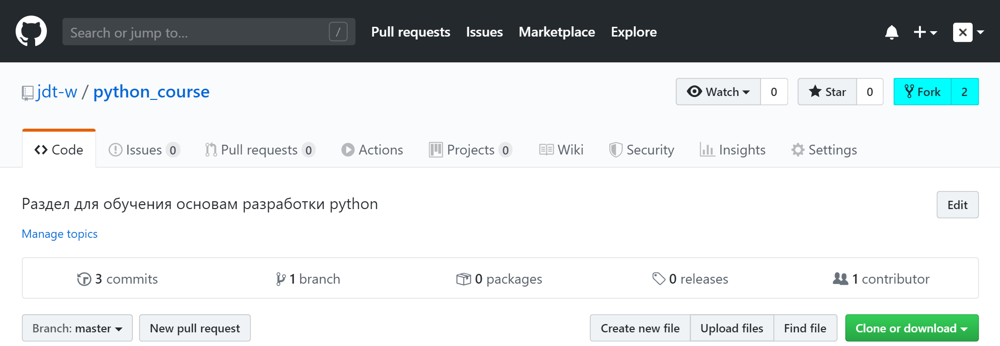
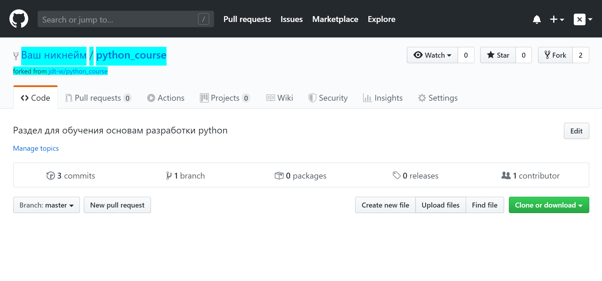
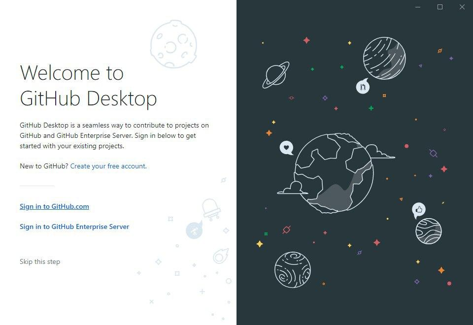
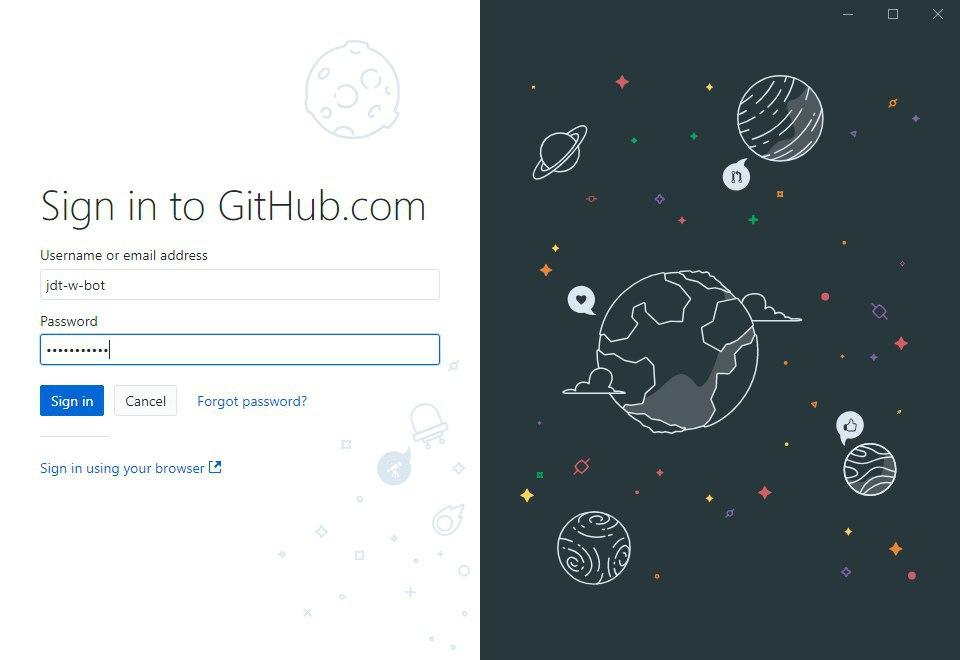
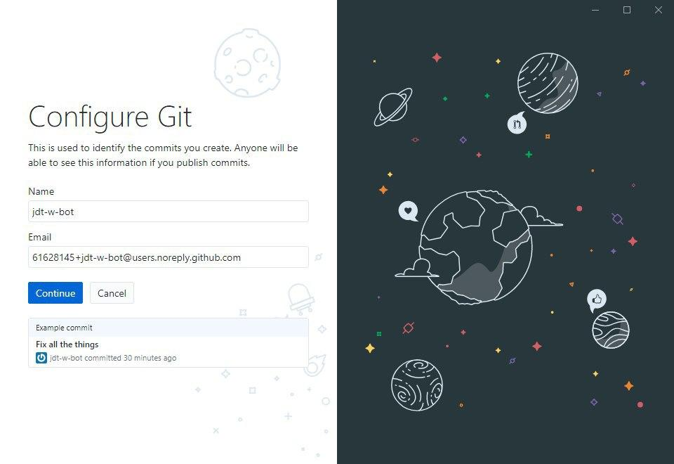
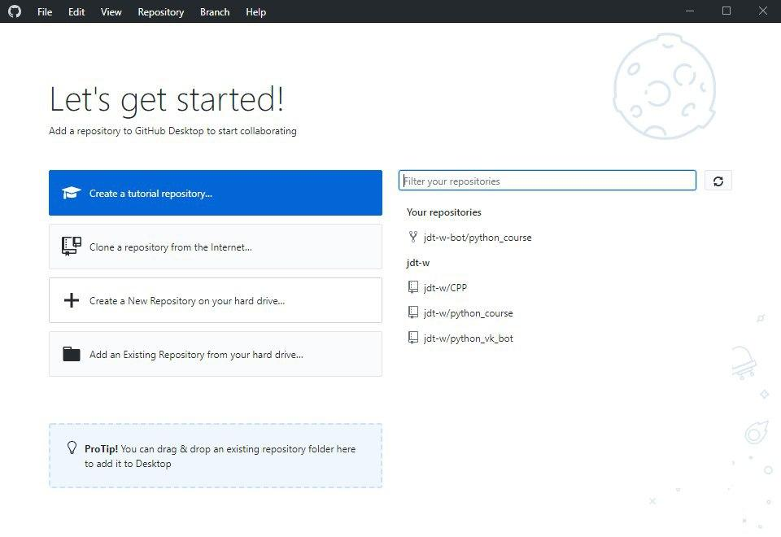
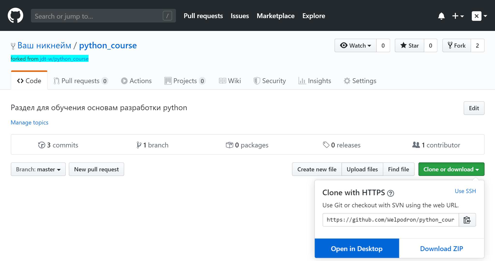
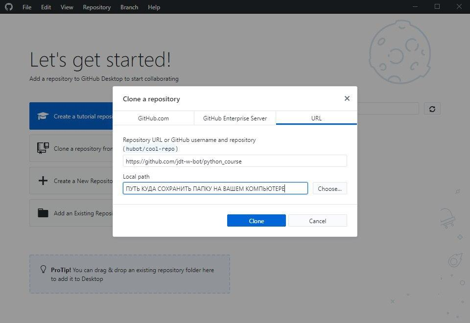
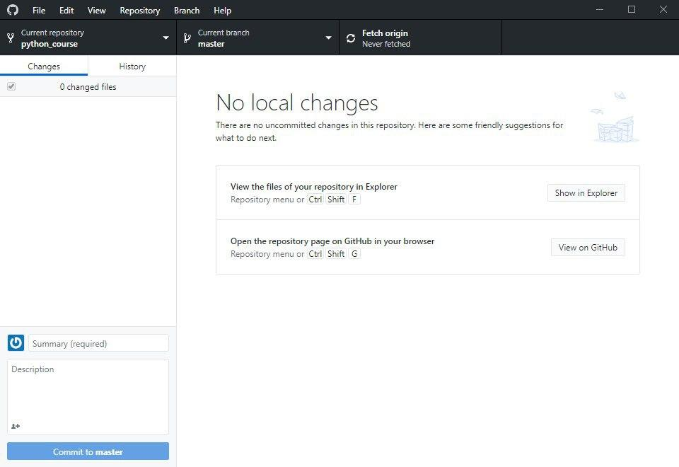

# Раздел 1 Обучение программированию на Python

### Задание 1: Подготовка к рабочему процессу часть 1

#### 1. Зарегистрируйтесь на Гитхабе

Если у вас ещё нет аккаунта на [github.com](https://github.com/join), скорее зарегистрируйтесь.

#### 2. Создайте форк (скопируйте репозиторий)

[Откройте мастер-репозиторий](https://github.com/jdt-w/python_course) и нажмите кнопку «Fork» в правом верхнем углу. Репозиторий из группы будет скопирован в ваш аккаунт. 



В результате в окне вашего браузера будет открыта новая страница, на которой находится скопированный вами репозиторий: 



#### 3. Скачайте и установите GitHub Desktop

[Ссылка на github desktop](https://desktop.github.com/)

#### Инструкция использования:

* После установки приложения у нас появится данное окно: 



* Выбираем пункт:
```
Sign in to GitHub.com
```



* Вводим свои данные и нажимаем кнопку:
```
 Sign in
```



* Нажимаем кнопку:
```
 Continue
``` 

* После успешного входа в аккаунт появляется данное окно:




* Переходим в скопированный вами репозиторий в пункте 2

#### 4. Клонируйте (скачайте) репозиторий на свой компьютер

Будьте внимательны: нужно клонировать свой репозиторий (форк), а не репозиторий группы (пункт 2). Для скачивая и работы с репозиторием на локальной машине необходимо воспользоваться бесплатной программой github desktop.



В результате откроется приложение github desktop, в котором необходимо выбрать папку, куда сохранить репозиторий на вашем компьютере: 



После успешной загрузки репозитория на ваш пк окно github desktop будет выглядеть, как показано на скриншоте:

