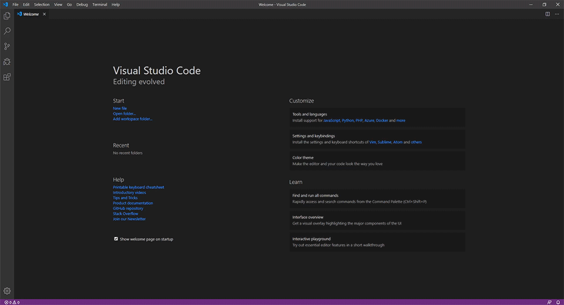
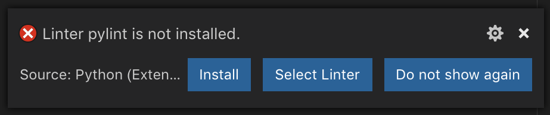
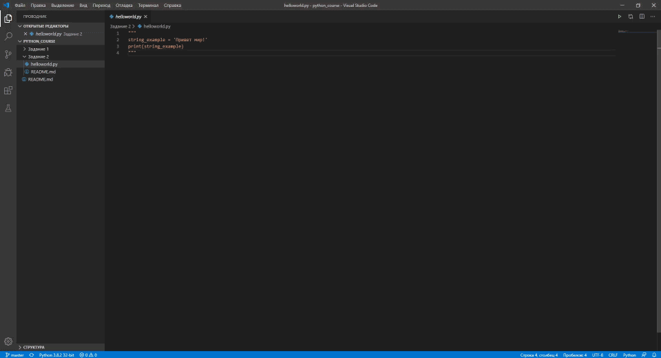
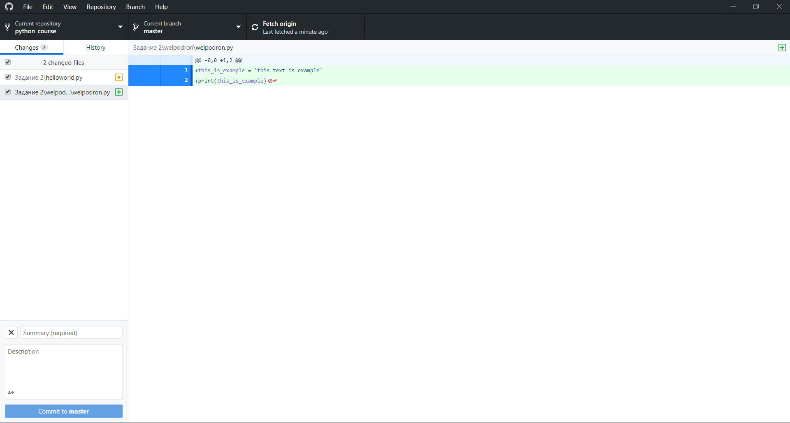
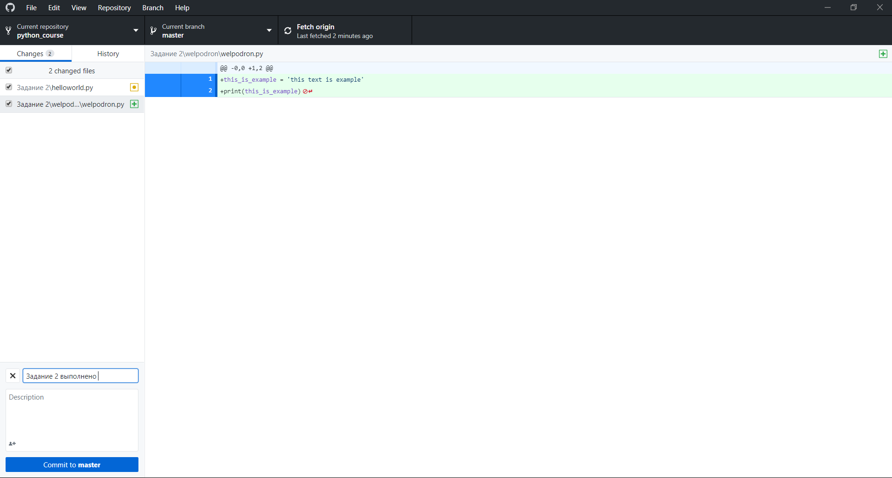
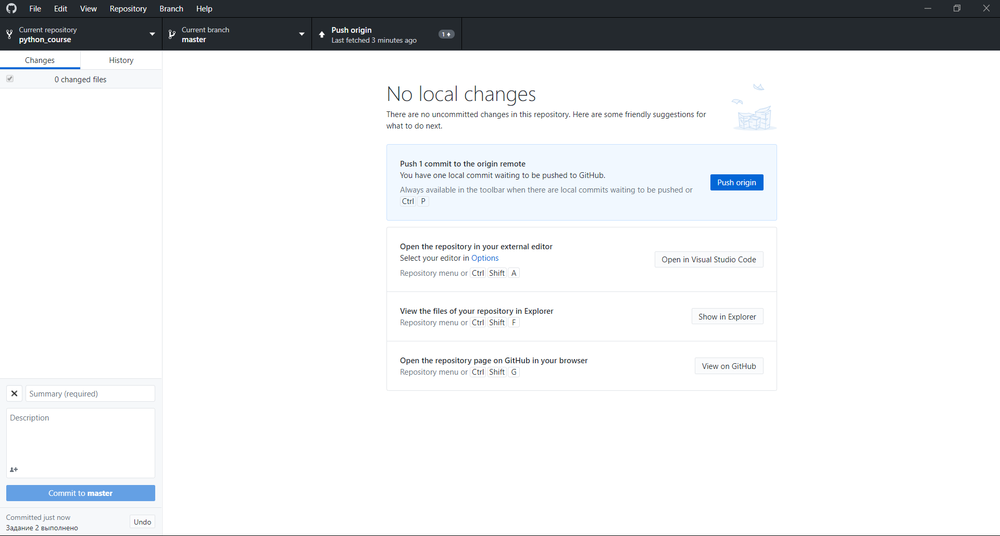
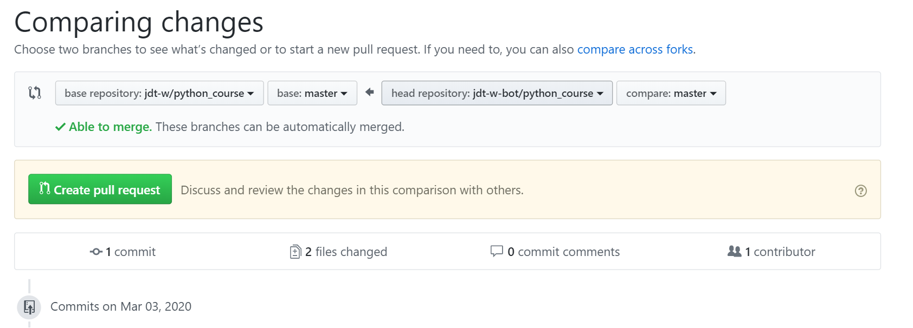
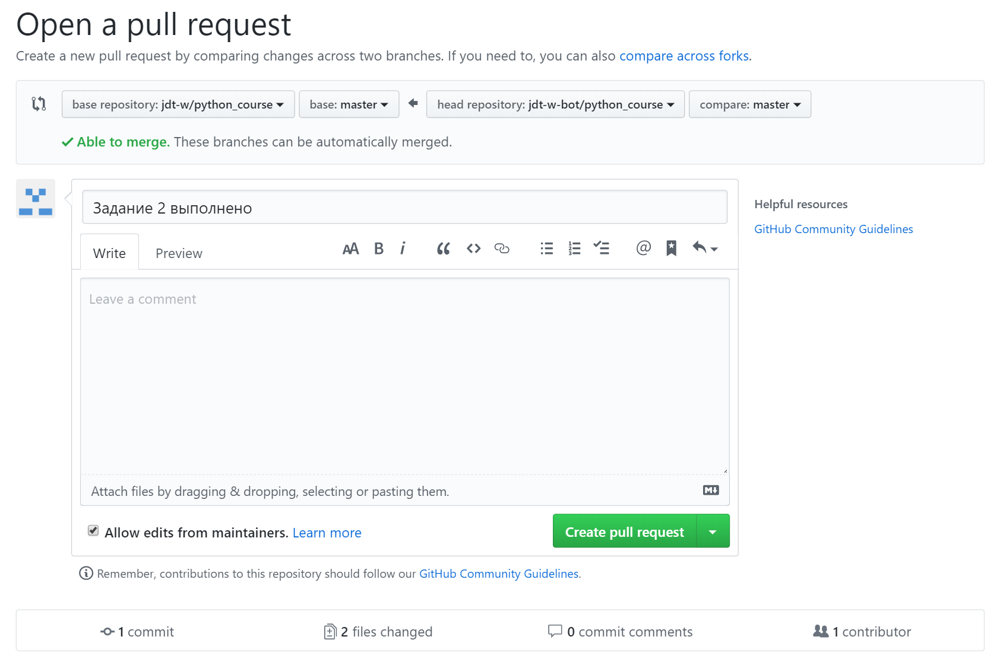

# Раздел 1 Обучение программированию на Python

### Задание 2: Подготовка к рабочему процессу часть 2

#### 1. Установка Python IDE

При установке отмечаем **каждый** предложенный пункт галочкой

[Ссылка на Python IDE](https://www.python.org/getit/)


#### 2. Установка VS Code

При установке в разделе **дополнительные задачи** отмечаем **каждый** предложенный пункт галочкой  

[Ссылка на Visual Studio Code](https://code.visualstudio.com/Download)

#### 3. Установка Git 

При установке **не меняем никакие настройки** и просто нажимаем `Next >` до конца установки

[Ссылка на Git](https://git-scm.com/download)

#### 4. Установка Python для VS Code

Устанавливаем необходимые для работы дополнения: 



После установки перезапускаем VS CODE

#### 5. Открываем папку проекта

При открытии папки выбираем папку нашего проекта:


**ВНИМАНИЕ**

Если после открытия файла или во время его запуска в правом нижнем углу появляется ошибка линтера:



Необходимо просто нажать кнопку `Install`, vs code автоматически исправит проблему 

#### 6. Создание первой программы на Python

* Раскомментируйте блок кода в файле `helloworld.py`

В результате у вас получится следующий блок кода:

```python
string_example = 'Привет мир!'
print(string_example)
```

О выполняемом коде: 

В строке: `string_example = 'Привет мир!'` мы создали переменную типа `string` (строка) с именем  `string_example` (слово string в имени переменной string_example не несёт никакой роли, оно лишь выбрано
для лучшего понимания, что данная переменная является строкой `*`) и присвоили ей значение `'Привет мир!'`

`*` - чтобы лучше понять синтаксис python ниже приведена наглядная демонстрация значения имён переменных:

```python
string_example = 'Привет мир!'
example = 'Привет мир!'
text = 'Привет мир!'
a = 'Привет мир!'
vasya_228 = 'Привет мир!'
```
`string_example` , `example` , `text` , `a` , `vasya_228` - являются строками (неважно как называть переменную)

**Подробнее о строках в Python будет рассказано в следующих заданиях**

В строке: `print(string_example)` мы вызвали встроенную в базовую библиотеку Python функцию `print()` `**` и передали ей аргумент `string_example`

`**` - функция `print(АРГУМЕНТ)` выводит в консоль переданный ей аргумент

```python
print(98)
print('Текст')
print(98 + 2)

"""
В окне консоли будет выведено:
98
Текст
100
"""
```

**Подробнее о функциях в Python будет рассказано в следующих заданиях**

* Запустите блок с кодом:

Для этого находясь в файле `helloworld.py` нажмите кнопку `F5` и выберете первый элемент из выпадающего списка в результате работы программы в консоль (терминал) будет выведено `Привет мир!`



#### 7. Выполнение задания 2

В данном задании вам необходимо создать в папке `Задание 2` папку, имеющее название, соответствующее вашему никнейму на Github (например: у папки, в моём случае, название будет: `welpodron`). В созданной вами папке, необходимо создать новый файл, имеющий имя вашей папки, а также с расширением `.py` (например, файл, в моём случае будет выглядеть: `welpodron.py`). В файле вам необходимо создать **строковую** переменную и присвоить ей любое значение **значение строковых переменных заключается в кавычки `' '` или в `" "`** (например: `_example = 'Случайный-текст'` или `_example = "Случайный-текст"`) (обратите внимание, что название переменной не может содержать специальных символов, в том числе и тире (используйте нижние подчёркивания)) Используя функцию `print()` выведете значение данной переменной в консоль и проверьте работу программы нажав `F5`. В случае если программа не вызывает ошибок и значение переменной выводится в консоль, переходите к разделу 8. Обновление клонированного репозитория   

**Примечания:** 

* (Образец решённого задания содержится в папке: `welpodron`)
* При создании папок и файлов используйте функционал VS Code: для создания новой папки щёлкните правой кнопкой мыши по папке `Задание 2` и выберете пункт `Новая папка`, затем введите название данной папки и нажмите `Enter`,
для создания файла нажмите правой кнопкой мыши по созданной вами папке и выберете пункт `Создать файл`, введите название файла и его расширение (например, в моём случае, `welpodron.py`) и нажмите `Enter`
* Полный функционал vs code можно изучить на официальном сайте проекта: [vs code docs](https://code.visualstudio.com/docs) доступно в английском варианте, по мере продвижения курса, я создам собственное описание функционала vs code для python разработчика 

#### 8. Обновление клонированного репозитория 

После всех проделанных операций, необходимо сохранить изменения не только локально, но и на серверах github, так как мы работали с проектом, к которому мы не имели доступа напрямую, то в предыдущем занятии мы создали его форк (клонировали его себе), прежде чем мы сможем осуществить запрос к обновлению мастер-репозитория, давайте обновим наш форк

Для этого откроем Github desktop и увидим, что приложение автоматически обнаружило наши изменения: 



Для того чтобы выполнить пуш (запушить изменения в ваш репозиторий) необходимо создать коммит, для этого сначала в строке `Summary (required)` добавим заключение того, что мы сделали, например: 



и нажмём кнопку `Commit to master`

После мы можем запушить наш коммит в наш репозиторий, нажимаем любую из кнопок `Push origin`:



#### 9. Обновление мастер-репозитория 

После проделанных операций осуществим запрос (пул реквест) к мастер-репозиторию, из нашего форка:


В результате откроется браузер в котором мы подтверждаем наш запрос нажатием на кнопку: `Create pull request` **2 раза**

Первый раз:


Второй раз:

